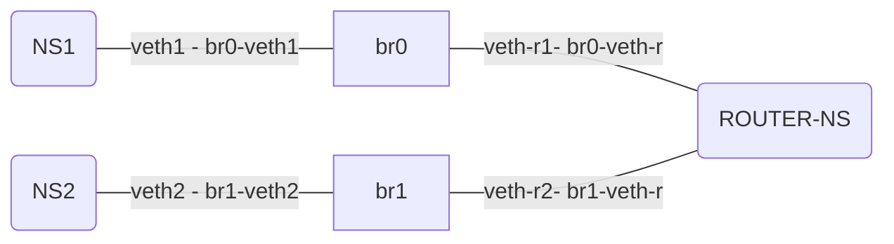

## Network Namespace Simulation

  

## Table of Contents

1. [Architecture Overview](#architecture-overview)

2. [Component Details](#component-details)

3. [Implementation Details](#implementation-details)

4. [Configuration Reference](#configuration-reference)

5. [Testing Procedures](#testing-procedures)

6. [Troubleshooting Guide](#troubleshooting-guide)


## Architecture Overview


##  Component Details

### Key Components

- Network Namespaces (x3)

- Network Bridges (x2)

- Virtual Ethernet Pairs

- Routing Configuration

- IPTables Rules

#### Network Namespaces

	1.  ns1 (Endpoint 1)

		- IP Address: 10.0.1.2/24

		- Default Gateway: 10.0.1.1

		- Connected to: br0

  

	2.  ns2 (Endpoint 2)

		- IP Address: 10.0.2.2/24

		- Default Gateway: 10.0.2.1

		- Connected to: br1

  

	3.  router-ns (Router)

		- Interface 1: 10.0.1.1/24

		- Interface 2: 10.0.2.1/24

		- IP Forwarding: Enabled

  

#### Network Bridges

	1.  br0

		- Network: 10.0.1.0/24

		- Connected Interfaces:

			- br0-veth1 (to ns1)

			- br0-veth-r (to router-ns)

  

	2.  br1

		- Network: 10.0.2.0/24

		- Connected Interfaces:

			- br1-veth2 (to ns2)

			- br1-veth-r (to router-ns)


## Implementation Details

  

### Network Creation Process

1.  **Namespace Creation**

```bash

ip netns add ns1

ip netns add ns2

ip netns add router-ns

```

  

2.  **Bridge Setup**

```bash

ip link add br0 type bridge

ip link add br1 type bridge

ip link set br0 up

ip link set br1 up

```

  

3.  **Virtual Ethernet Pairs**

```bash

# For ns1

ip link add veth1 type veth peer name br0-veth1

# For ns2

ip link add veth2 type veth peer name br1-veth2

# For router-ns

ip link add veth-r1 type veth peer name br0-veth-r

ip link add veth-r2 type veth peer name br1-veth-r

```
### Routing Configuration

1.  **IP Forwarding**

```bash

sysctl -w net.ipv4.ip_forward=1

ip netns exec router-ns sysctl -w net.ipv4.ip_forward=1

```

  

2.  **Route Configuration**

```bash

# In ns1

ip netns exec ns1 ip route add default via 10.0.1.1

# In ns2

ip netns exec ns2 ip route add default via 10.0.2.1

```

## Configuration Reference

  

### IP Addressing Scheme

	- Network 1: 10.0.1.0/24

		- Router: 10.0.1.1

		- ns1: 10.0.1.2

  

	- Network 2: 10.0.2.0/24

		- Router: 10.0.2.1

		- ns2: 10.0.2.2

  

### Required System Settings

- Bridge-netfilter Configuration

- IP Forwarding

- IPTables Default Policies

## Testing Procedures

  

### Connectivity Tests

1.  **Local Network Tests**

```bash

# Test ns1 to router

ip netns exec ns1 ping -c 2 10.0.1.1

# Test ns2 to router

ip netns exec ns2 ping -c 2 10.0.2.1

```

  

2.  **Cross-Network Tests**

```bash

# Test ns1 to ns2

ip netns exec ns1 ping -c 3 10.0.2.2

# Test ns2 to ns1

ip netns exec ns2 ping -c 3 10.0.1.2

```
## Troubleshooting Guide
  

### Common Issues and Solutions

  

1.  **Connectivity Issues**

	- Problem: Ping fails between namespaces

	- Checks:

		- Verify IP forwarding is enabled
	
		- Check routing tables
	
		- Ensure interfaces are up
	
		- Verify bridge configuration

  

2.  **Bridge Issues**

	- Problem: Bridge interface not working

	- Checks:

		- Verify bridge is up
	
		- Check connected interfaces
	
		- Verify bridge-netfilter settings

  

3.  **Routing Issues**

	- Problem: Traffic not forwarding

	- Checks:
	
		- Verify IP forwarding
	
		- Check default routes
	
		- Verify IPTables rules


